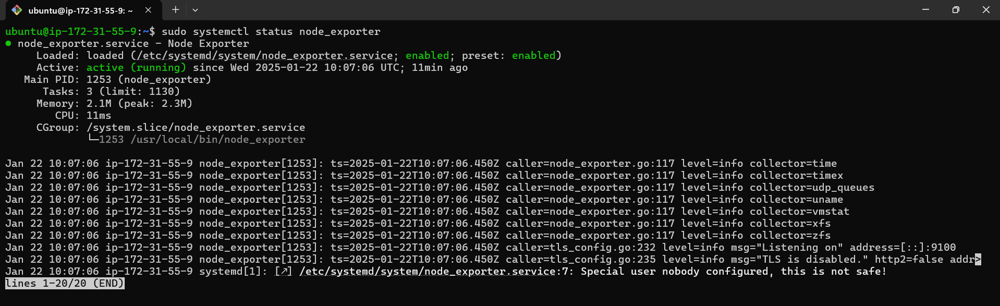
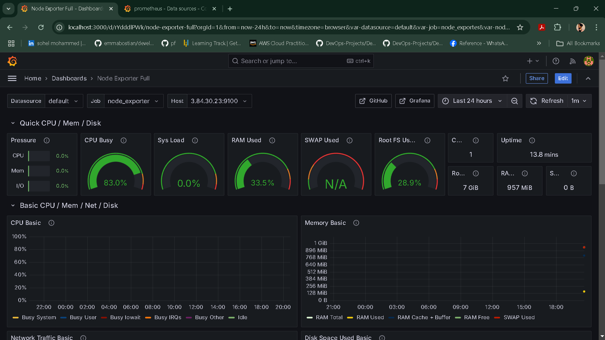

# Monitoring EC2 Instances with Grafana, Prometheus, and Node Exporter

Monitoring your EC2 instances is essential to ensure they are performing optimally and to identify potential issues before they escalate. This README provides a step-by-step guide to monitor your EC2 instance using **Grafana**, **Prometheus**, and **Node Exporter**.

---

## **What You'll Need**
1. An EC2 instance running on AWS.
2. Installed Docker and Docker Compose on your instance (or manual installation of Grafana, Prometheus, and Node Exporter).
3. Basic knowledge of how to connect to your EC2 instance.

---

## **Step 1: Install Node Exporter**

Node Exporter is a lightweight monitoring agent that exposes system metrics like CPU, memory, and disk usage.

1. **Update Your System**:
   ```bash
   sudo apt-get update
   ```

2. **Download Node Exporter**:
   ```bash
   wget https://github.com/prometheus/node_exporter/releases/download/v1.5.0/node_exporter-1.5.0.linux-amd64.tar.gz
   ```

3. **Extract the Archive**:
   ```bash
   tar xvfz node_exporter-1.5.0.linux-amd64.tar.gz
   ```

4. **Move Node Exporter Binary**:
   ```bash
   sudo mv node_exporter-1.5.0.linux-amd64/node_exporter /usr/local/bin/
   ```

5. **Create a Node Exporter User**:
   ```bash
   sudo useradd --no-create-home --shell /bin/false node_exporter
   ```

6. **Create a Systemd Service File**:
   ```bash
   sudo vi /etc/systemd/system/node_exporter.service
   ```
   Add the following content:
   ```
   [Unit]
   Description=Node Exporter
   Wants=network-online.target
   After=network-online.target

   [Service]
   User=node_exporter
   Group=node_exporter
   Type=simple
   ExecStart=/usr/local/bin/node_exporter

   [Install]
   WantedBy=multi-user.target
   ```

7. **Start and Enable Node Exporter**:
   ```bash
   sudo systemctl daemon-reload
   sudo systemctl start node_exporter
   sudo systemctl enable node_exporter
   ```

8. **Check Node Exporter Status**:
   ```bash
   sudo systemctl status node_exporter
   ```



9. **Verify Metrics Endpoint**:
   Access the metrics endpoint in your browser:
   ```
   http://<EC2_PUBLIC_IP>:9100/metrics
   ```

---

## **Step 2: Set Up Prometheus**

Prometheus scrapes metrics from Node Exporter and stores them for visualization.

1. **Create a Prometheus Configuration File**:
   Create a file named `prometheus.yml`:
   ```yaml
   global:
     scrape_interval: 15s

   scrape_configs:
     - job_name: 'prometheus'
       static_configs:
         - targets: ['localhost:9090']

     - job_name: 'node_exporter'
       static_configs:
         - targets: ['<EC2_PUBLIC_IP>:9100']
   ```

2. **Run Prometheus Using Docker**:
   ```bash
   docker run -d --name prometheus -p 9090:9090 \
   -v /path/to/prometheus.yml:/etc/prometheus/prometheus.yml prom/prometheus
   ```

3. **Restart Prometheus After Node Exporter Setup**:
   If Node Exporter was set up after Prometheus was already running, restart Prometheus to pick up the new configuration:
   ```bash
   docker restart prometheus
   ```

4. **Verify Prometheus**:  
   Access Prometheus at:  
   ```
   http://<EC2_PUBLIC_IP>:9090
   ```
   Go to **Status > Targets** to confirm Node Exporter is being scraped.

---

## **Step 3: Set Up Grafana**

Grafana visualizes the metrics collected by Prometheus.

1. **Run Grafana Using Docker**:
   ```bash
   docker run -d --name grafana -p 3000:3000 grafana/grafana
   ```

2. **Access Grafana**:  
   Open Grafana in your browser:  
   ```
   http://<EC2_PUBLIC_IP>:3000
   ```
   Default credentials:
   - Username: `admin`
   - Password: `admin`

3. **Add Prometheus as a Data Source**:
   - Go to **Configuration > Data Sources > Add data source**.
   - Select **Prometheus** and enter the URL: `http://<EC2_PUBLIC_IP>:9090`.

4. **Import a Dashboard**:
   - Go to **Create > Import**.
   - Use a Node Exporter dashboard ID from [Grafana's dashboard repository](https://grafana.com/grafana/dashboards/).
   - Example: Dashboard ID `1860` (Node Exporter Full).

---

## **Step 4: Monitor Your EC2**

Once everything is set up:
- Open your Grafana dashboard to visualize CPU, memory, disk, and network usage metrics for your EC2 instance.
- Verify the Node Exporter status in Prometheus under **Status > Targets**.
- Use Grafana’s dashboards to analyze metrics and gain insights.
- Configure alerts in Grafana or Prometheus for proactive monitoring.

---




## **Benefits of This Setup**

1. **Centralized Monitoring**: View all system metrics in Grafana's beautiful dashboards.
2. **Custom Dashboards**: Tailor Grafana to display only the metrics you care about.
3. **Scalable Solution**: Add more EC2 instances and monitor them by updating Prometheus configuration.

---

## **Conclusion**

By integrating Node Exporter, Prometheus, and Grafana, you’ve set up a powerful monitoring stack for your EC2 instances. This setup not only helps you keep an eye on system health but also ensures you're ready to act on any performance issues.

Happy Monitoring! 🚀

